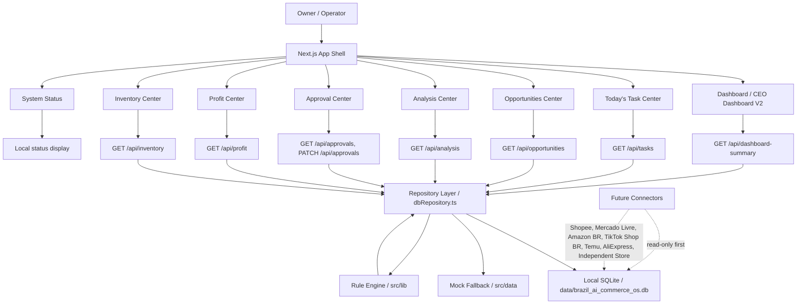
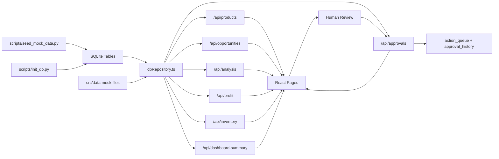
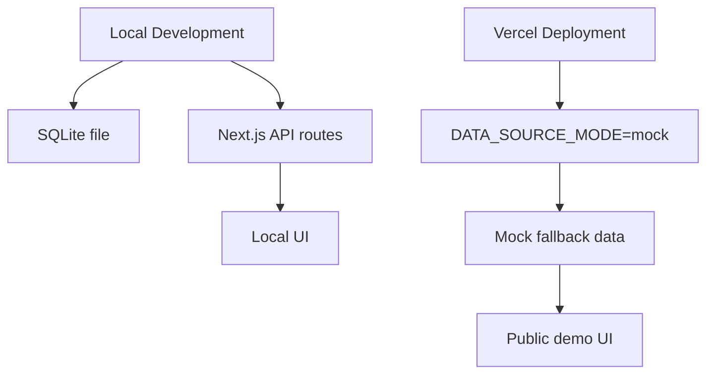

# Brazil AI Commerce OS Lite - System Architecture

Last updated: 2026-06-17

## 1. Current System Shape

The current system is a local-first Next.js application with SQLite-backed API routes and mock fallback.

It is not connected to real platform APIs, real crawler jobs, real AI models, or real execution systems.

## 2. High-Level Architecture

## 3. Data Flow

## 4. Module Responsibilities

Dashboard:

- Aggregates data from profit, inventory, opportunities, approvals, risk, and system health.
- Helps the owner answer whether the business is making money, whether inventory is risky, and what needs review today.

Tasks:

- Shows today's task overview, TOP5 tasks, priority queues, AI suggestions, source statistics, and impact statistics.
- Converts opportunity, analysis, approval, profit, and inventory data into task cards.
- Tasks link to their source page for human handling.
- Reads from `/api/tasks`.
- Does not execute any real platform or replenishment action.

Opportunities:

- Shows opportunity products, keyword opportunities, and risk alerts.
- Supports filters and sorting.
- Reads from `/api/opportunities`.

Analysis:

- Shows rules-based opportunity, risk, market, and recommendation analysis.
- Does not connect to OpenAI or real AI models.
- Reads from `/api/analysis`.

Approvals:

- Shows approval queue, status operations, history, and stats.
- `PATCH /api/approvals` updates local SQLite only.
- Does not execute platform actions.

Profit:

- Shows profit snapshot, cost structure, profit risk, and product profit ranking.
- Reads from `/api/profit`.

Inventory:

- Shows inventory snapshot, SKU monitoring, risk alerts, and reorder suggestions.
- Reads from `/api/inventory`.
- Does not trigger replenishment.

Connectors:

- Not implemented yet.
- Future connectors should be read-only first.
- Real write actions must stay behind approval and execution queues.

## 5. Runtime Modes

SQLite mode:

- `DATA_SOURCE_MODE=sqlite`
- API attempts to read `SQLITE_DB_PATH`.
- If SQLite is missing or fails, repository returns mock fallback.

Mock mode:

- `DATA_SOURCE_MODE=mock`
- API returns mock data directly.
- Recommended for Vercel demo deployment.

## 6. Deployment Architecture

## 7. Execution Boundary

The current system never executes real platform actions.

Allowed:

- Read local SQLite.
- Read mock fallback.
- Display recommendations.
- Update local approval status.
- Write local approval history.

Not allowed:

- Upload real products.
- Change real prices.
- Change real titles.
- Change real images.
- Change real ad budgets.
- Trigger real replenishment.
